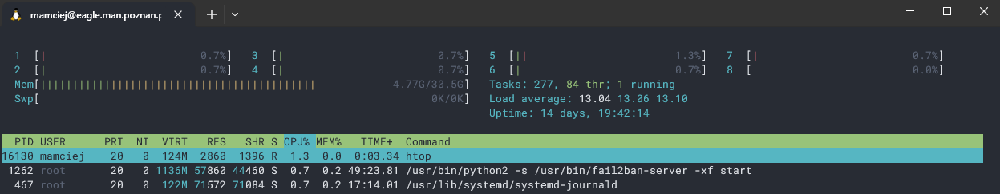
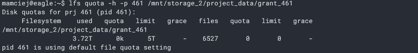
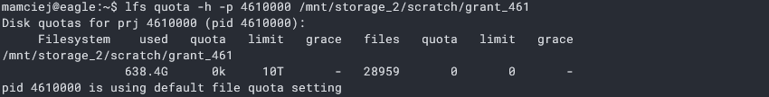
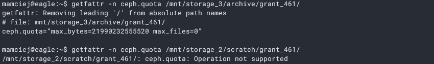

# Podstawy Eagla

W tym artykule nie będziemy przedstawiać sobie architektury, ani tego jak dokładnie działa Eagle. Skupimy się na opisie podstawowych cech, które są niezbędne, aby poprawnie korzystać z serwera.

> **Note**
> Artykuł stworzony na podstawie https://wiki.man.poznan.pl/kdm/Dane_na_klastrze_Eagle
> Wiele kwestii jest opisane na WIKI KDM i będziemy odsyłać do stosownych sekcji w celu uzyskania szczegółowych informacji. Z drugiej strony, wiele rzeczy warto opisać od innej strony, ponieważ WIKI KDM jest napisana momentami chaotycznie i czasem trudno w niej znaleźć potrzebne informacje.


## Spis treści

<details>
<summary>Kliknij by rozwinąć</summary>

- [Podstawy Eagla](#podstawy-eagla)
  - [Spis treści](#spis-treści)
  - [Struktura katalogów](#struktura-katalogów)
    - [Katalog domowy](#katalog-domowy)
    - [Przestrzenie robocze](#przestrzenie-robocze)
  - [Sprawdzanie zużycia przestrzeni w grancie](#sprawdzanie-zużycia-przestrzeni-w-grancie)
  - [Poprzednia struktura w skrócie](#poprzednia-struktura-w-skrócie)
  - [Szczegóły sprzętowe dostępnych węzłów](#szczegóły-sprzętowe-dostępnych-węzłów)

</details>

## Struktura katalogów

### Katalog domowy
Po wejściu na serwer, użytkownik znajduje się w katalogu domowym - `/home/users/<nazwa_uzytkownika>`. Katalog domowy nie jest miejscem na przechowywanie danych, a jedynie składem na katalogi grantów obliczeniowych, które są przypisane do danego użytkownika. Nazwa katalogów grantowych to `grant_<numer_grantu>`

Ponadto, nie powinno się tutaj wykonywać żadnych obliczeń ani w zasadzie żadnych innych operacji, ponieważ jesteśmy wtedy niejako na ograniczonej obliczeniowo maszynie, która służy głównie do nawigacji po przestrzeni plików i włączaniu zadań na węzłach. Można to zobaczyć wpisując polecenie `htop`. Przykładowo, widać, że ilość dostępnych wątków jest mała:

<p align="center">

</p>

Zatem, powinniśmy się ograniczyć tutaj do wykonywania co najwyżej najprostszych operacji na plikach i katalogach - usuwanie, kopiowanie, tworzenie, zmiana nazw i włączanie prostych skryptów basha.

### Przestrzenie robocze
W każdym katalogu grantowym znajdują się **linki** do następujących katalogów:

- `scratch/` - katalog przeznaczony do obliczeń - powinno się tutaj przechowywać pliki do prowadzenia obliczeń, tutaj powinny powstawać pliki wynikowe i również tutaj można instalować programy (w razie potrzeb). **Domyślna dostępna przestrzeń w tym katalogu to 10 TB**.
- `project_data/` - katalog współdzielony dla wszystkich użytkowników grantu, gdzie można dowolnie manipulować prawami dostępu pomiędzy użytkownikami. Dane znajdujące się we wszystkich podkatalogach tego katalogu zabezpieczone przed przypadkowym usunięciem mechanizmem automatycznych kopii zapasowych. **Domyślna dostępna przestrzeń w tym katalogu to 5 TB**.
- `archive/` - katalog do przechowywania danych, które nie są aktualnie wykorzystywane. Przestrzeń ta jest **wolniejsza niż dwie poprzednie, ale ma większy rozmiar - jeżli to konieczne, to nawet setki TB.**

Oprócz `archive`, pozostałe przestrzenie w trakcie trwania grantu nie mają znacznych różnic i jest to obojętne, z którego katalogu będą używane pliki do obliczeń. Warto pamiętać, że dane zgromadzone w `project_data` są dostępne przez okres 6 miesięcy od końca grantu, a później następne 6 miesięcy na specjalne żądanie.

> **Warning**
> Zaleca się korzystać z ścieżek korzystających z tych linków, ponieważ admini PCSS zastrzegają sobie możliwość zmian w każdej chwili fizycznych ścieżek w strukturze plików. Odwołując się do linków mamy pewność, że będzie on wskazywał na właściwe miejsce fizyczne do katalogu/plików. 
> 
> Gdyby wystąpiła potrzeba nawigacji po ścieżce fizycznej, to struktura jest następująca:
>```
>   mnt/
>       |-- storage_1/
>       |-- storage_2/
>       |   |-- project_data
>       |   |   |-- grant_<numer_grantu>
>       |   |   ...
>       |   |   |-- grant_<numer_grantu>
>       |   |-- scratch
>       |       |-- grant_<numer_grantu>
>       |       ...
>       |       |-- grant_<numer_grantu>
>       |-- storage_3
>       |   |-- archive
>       |       |-- grant_<numer_grantu>
>       |       ...
>       |       |-- grant_<numer_grantu>
>       |-- storage_4
>       |-- test

## Sprawdzanie zużycia przestrzeni w grancie

- `project_data`
  ```
  lfs quota -h -p <numer_grantu> <pelna_fizyczna_sciezka_do_folderu_grnatu_przez_project_data>
  ```
  <p align="center">
    
    </p>
- `scratch`
  ```
  lfs quota -h -p <numer_grantu>0000 <pelna_fizyczna_sciezka_do_folderu_grnatu_przez_scratch>
  ```
  <p align="center">
    
    </p>
- `archive`
  ```
  getfattr -n ceph.quota <pelna_fizyczna_sciezka_do_folderu_grnatu_przez_archive>
  ```
  <p align="center">
    
    </p>

    Na powyższym screenie widać, że podane polecenie jest możliwer do wykonania tylko dla `archive`.

## Poprzednia struktura w skrócie

Poprzednio w katalogu domowym użytkownika można było przechowywać pliki (co jest w sumie możliwe nadal), która była mniej więcej odpowiednikiem `project_data`. `scratch` miał podobną funkcję co teraz - służył do przechowania plików wynikowych i wejściowych. Różnicą jest to, że nie nazywał się `scratch` i był zlokalizowany w innym miejscu: `/tmp/lustre/<nazwa_uzytkownika>`. Dlaczego warto to wiedzieć? Jest to ważne, ponieważ w WIKI KDM niestety większość artykułów nie jest zaaktualizowana i powyżej wymieniona ścieżka ciągle funkcjonuje w podawanych przykładach.

## Szczegóły sprzętowe dostępnych węzłów

Dobry i szczegółowy opis znajduje się na WIKI KDM: https://wiki.man.poznan.pl/kdm/Uruchamianie_du%C5%BCych_zada%C5%84_na_klastrach_Eagle/Altair