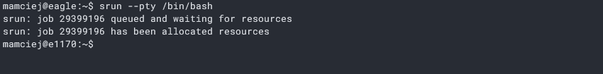
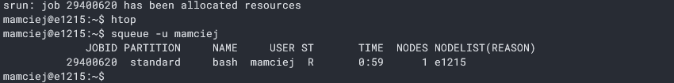
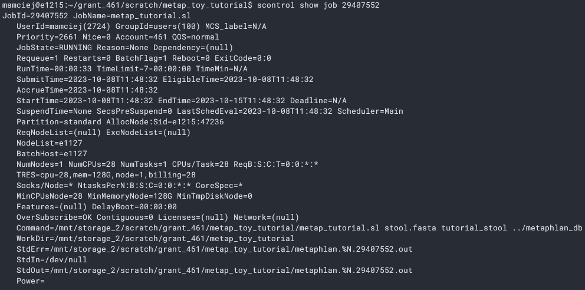

# System kolejkowy SLURM

Wszelkie zadania obliczeniowe na Eagle są kolejkowane przez system SLURM. To oznacza, że każde obliczenie musi być zlecone, a tym zleceniem jest przydział zasobów, czyli przydział pamięci oraz procesorów. W bardzo uproszczonej wersji - czekamy na "komputer", który będzie przeprowadzał obliczenia. Z tego też powodu, wszystkie ustawienia wykonane na koncie użytkownika na maszynie osługującej system plików nie zostaną zapisane (np. wyeksportowane ścieżki w PATH).

Zadania w tym systemie można wykonywać na 2 sposoby: interaktywnie oraz zlecając do wykonania skrypt z zestawem poleceń.

## Zlecanie zadań interaktywnych

Zadanie interaktywne to takie zadanie, w którym na przydzielonym węźle możemy używać powłoki tak jak normalnie. Aby je uruchomić, należy wpisać:

```
srun --pty /bin/bash
```

<p align="center">

</p>

Warto zauważyć, że przy nazwie użytkownika zmienia się maszyna - na początku po logowaniu jest to zawsze `@eagle`, a po uruchomieniu zadania jest tam identyfikator węzła - tutaj `@e1170`

> **Note**
> W zależności od obciążania, przydzielanie zasobów może trwać pewną chwilę - nawet to kilkudziesięciu minut. Aktualny status wykorzystania zasobów na Eagle można sprawdzić tutaj:
[<https://stats.hpc.pcss.pl>](https://stats.hpc.pcss.pl)

Przy zlecaniu zadania interaktywnego możemy zażądać określonej ilości rdzeni oraz pamięci RAM:

- ilość rdzeni określa parametr `-n`
- ilość pamięci RAM określa parametr `--mem`. **Pamięć musi być podana w MB**

Przykładowo, zażądanie 16 rdzeni oraz 128 GB pamięci będzie wyglądać tak:

```
srun --pty -n 16 --mem 128000 /bin/bash
```

Wyjście z węzła dokonuje się komendą `exit`

> **Warning**
> Wyjście z serwera wiąże się z przerwaniem działań na danym węźle.

## Zlecanie zadań w skrypcie

Ten rodzaj zlecania powinien być używany dla wymagających zadań, o których wiadomo, że będą trwać długo.

Operacje, które chcemy wykonać, należy opatrzeć w skrypt o specjalnej strukturze. Nie ma jednego przepisu na ten skrypt, natomiast można w nim wyróżnić elementy, które powinny się w nim znaleźć:
- nagłówek pliku - zawarty tam jest shebang odnoszący się do basha (`#!/bin/bash`) oraz parametry SBATCH:
  - `--time` - określa maksymalny czas zadania w formacie HHH:MM:SS
  - `--mem` - ilość żądanej pamięci - tutaj dla odmiany w GB, np. `128gb`
  - `--nodes` - ilość żądanych węzłów
  - `--cpus-per-task` - ilość żądanych rdzeni na każde zadanie
  - `-o` - pozwala na wyspecyfikowanie nazwy pliku z wyjściem z zadania, tj. tego co byłoby wypisane na STDOUT. Specjalne zmienne pozwalają na dodanie do nazwy pliku identyfikatora węzła, który obsługiwał dane zadanie (`%N`) oraz identyfikator zadania (`%j`).
  - `-e` - pozwala na wyspecyfikowanie nazwy pliku z wyjściem błędów z zadania, tj. tego co byłoby wypisane na STDERR
- przygotowanie modułów (komenda `module`), środowisk (np. pythona komendą `source`), ścieżek (np. eksportowanie do PATH) dla programów - jest to ważne, ponieważ po każdym zakończeniu zadania wszystkie tego typu ustawienia są zapominane
- docelowe polecenia, które chcemy wykonać

Wzór takiego skryptu jest dostępny [tutaj](./examples/example.sl).

Uruchomienie skryptu jest następujące:

```
sbatch <sciezka_do_skryptu>
```

Po zleceniu zadania, na STDOUT wypisywany jest numer zadania (JOBID). Na przykład:

```
Submitted batch job 29407552
```

> **Note**
> Jeżeli wiemy, że będziemy mogli sprawdzać statusu zadania, ale chcielibyśmy nadal go znać, to można zlecić informowanie o statusie przez maila. Dokładny opis raportowania przez mail znajduje się na [WIKI KDM](https://wiki.man.poznan.pl/kdm/Status_zadania_-_mail). Również w przykładowym skrypcie znaduje się ta opcja.

Aby zlecić wykonanie zadania na wielu plikach, można utworzyć skrypt basha, który w pętli będzie zlecał zadania zdefiniowane w skrypcie slurm.

> **Warning**
> Skrypt kolejkujący zadanie musi mieć znaki przewania linii zgodne ze systemami Unix, czyli LF. Koniecznie trzeba zwrócić na to uwagę, gdy skrypt taki pisze się w systemie Windows (domyślnie jest tam używany CRLF).

## Monitorowanie i zarządzanie zleconymi zadaniami

Możliwe jest podejrzenie statusu zleconych zadań przez użytkownika za pomocą komendy:

```
squeue -u <nazwa_uzytkownika>
```

<p align="center">

</p>

Jak widać powyżej, nawet zadanie interaktywne jest tam ujęte i otrzymuje swój numer identyfikacyjny (JOBID).

W kolumnie NAME znajduje się nazwa zadania, która jest pobierana z nazwy uruchamianego skryptu lub polecenia (interaktywne zadanie jest zatem nazwane bash, bo uruchomiliśmy powłokę komendą `srun --pty /bin/bash`).

Kopiując identyfiaktor zadania, możemy uzyskać dokładniejsze informacje o jego statusie za pomocą komendy:
```
scontrol show job <JOBID>
```

Można uzuskać dodatkowe informacje o zadaniu takie jak:
  - status zadania - czy jest w kolejce, wykonywane, zakończone itp.
  - priorytet zadania (Priority)
  - przydzielone zasoby do zadania (NumNodes, NumCPUs, CPUs/Task, mem)
  - czas startu, aktualny czas trwania oraz maksymalny czas zakończenia (SubmitTime, StartTime, RunTime, EndTime)
  - pełna, użyta komenda do wywołania zadania (Command)
  - nazwy plików z wyjściem (`-o`; StdOut) i błędami (`-e`; StdErr)

<p align="center">

</p>

W razie przypadku, gdy coś pójdzie nie tak, można anulować zadanie za pomocą:

```
scancel <JOBID>
```

Taka komenda, naturalnie, przerywa wykonywanie tylko jednego zadania. Zdarza się zlecanie wielu zadań równolegle, na wielu plikach i wtedy trzeba je wszystkie usunąć. W tym celu stworzyłem [skrypt basha](./examples/cancel_jobs.sh), który pozwala na usuwanie wszystkich aktywnych zadań lub zadań o określonej nazwie. 